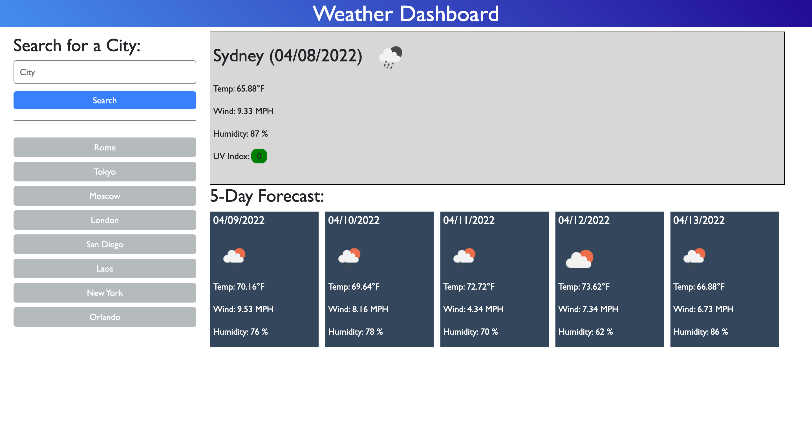

# Weather Dashboard

## Description

This is my first task using a server side API's. This page takes a city name and matches it with an open source weather API that provides historical and current weather forecast data.

This was a new challenge to me because this was my first time looking through the documentation of an API. It confusing at first but eventually I figured out how to get the correct response and comb through the data.

Problems I came across where getting the from submissions and recent search history to work properly. Making sure the correct values were being submitted and then stored for later use took alot of time for me to figure out properly.

## Link to Live Page

https://charliefontanez.github.io/Weather-Dashboard/

## Tools Used

- HTML
- CSS
- Javascript
- Moment.js
- Bootstrap
- jQuery
- OpenWeatherMap Geocoding API
- OpneWeatherMap One Call API
